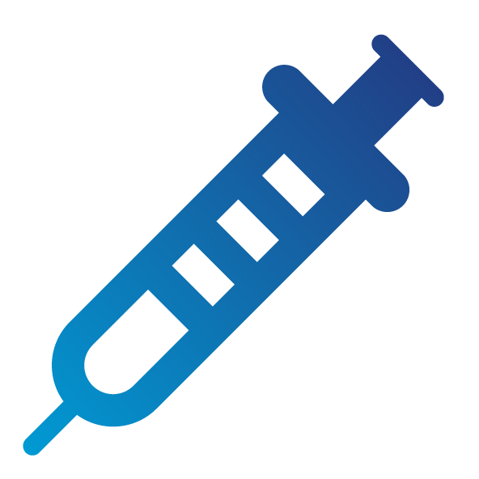
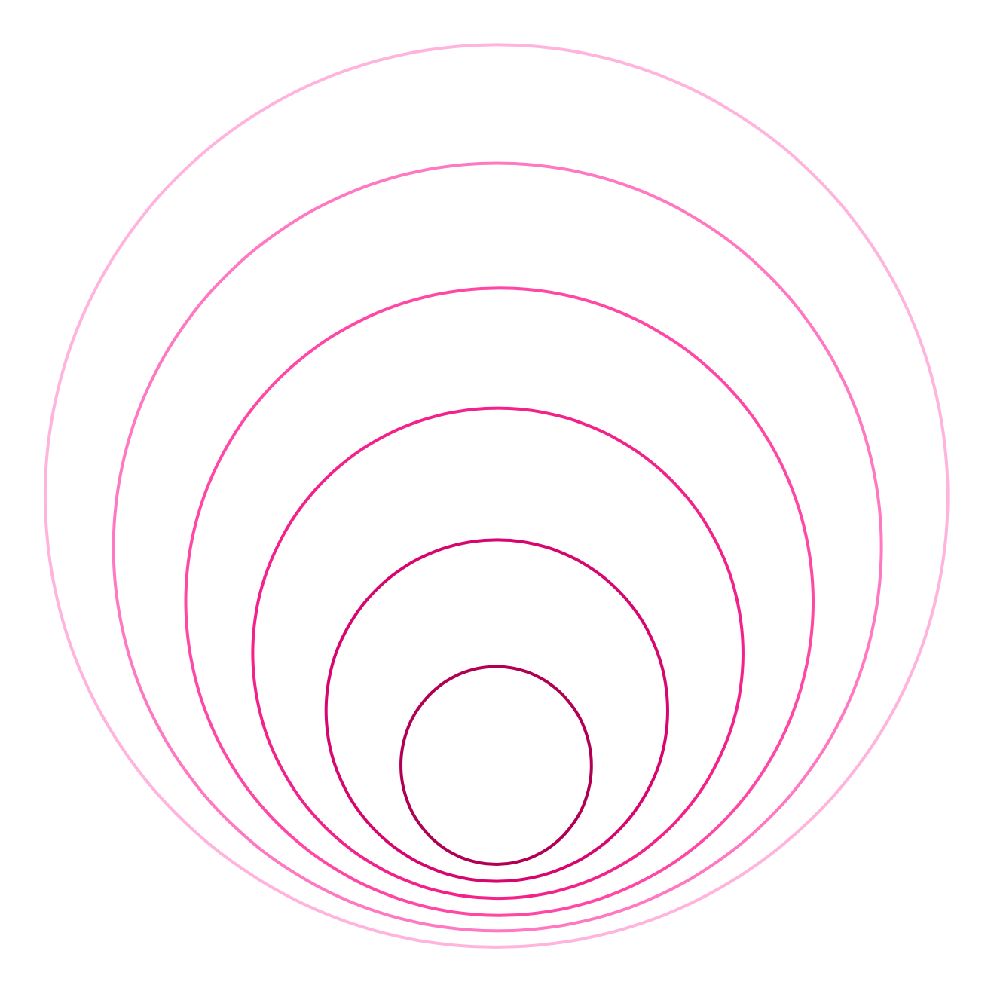
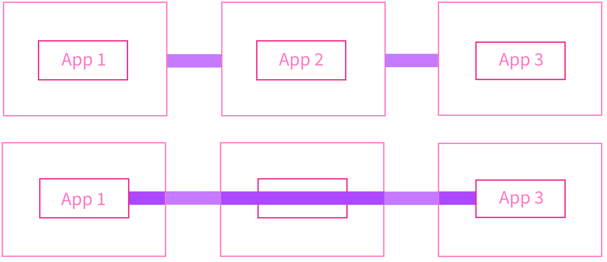
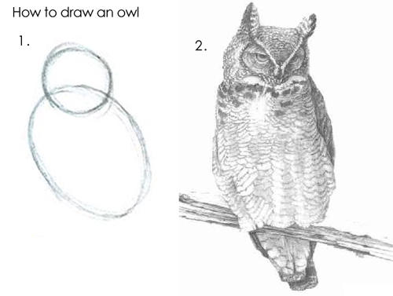

slidenumbers: false
autoscale: true
build-lists: false
list: bullet-character(∙)
text: alignment(left), text-scale(1.2), line-height(1)

<!-- Ostrich Sans / Work Sans / Titillium / Franziska FF / Alegreya Sans -->
<!-- ⁃ ☑︎ ◦ ∙ ✪ -->

# **OWASP Top 10:** 2021 Edition

### _Matthew Sheehan_

---

## About **OWASP Top 10**

1st release in 2003. **⁃** 7th release in 2021.

|  | Release |
| --- | --- |
| Chrome | 2008 |
| iPhone | 2007 |
| Azure | 2008 |
| AWS | 2006 |
| Git | 2005 |
| Facebook | 2004 |
| **OWASP Top 10** | **2003** |

^ Why doesn't the top 10 update more often?
  - It would be hard to adopt training for the top 10 if it was a constantly moving target. The cadence generally is every 3 years.

---

## About **OWASP Top 10**

- Targeted at developers, architects, and security professionals.
- The ten most critical risks identified in web applications.
  - Risk = Likelihood x Impact
- Built as a data-driven **_awareness_** document, not as a standard.
- Was actually suppose to be OWASP Top 10: 2020. :sweat_smile:

^ Targeted at developers:
  - One of the biggest challenges to security is figuring out how to engage developers.
  - There are not enough AppSec professionals, you have to empower and support your developers.
  - Developers can't be expected to remember every detail, languages and frameworks need updated so that writing secure code is the default.

^ Then most critical risks:
  - Not indicative of the likelihood or the impact of the vulnerability.
  - Keep in mind, its just the top 10, it could have just as easily been the top 11 or top 20, because there is still the 11th - nth risk.

^ Not built as a standard:
  - But the truth is is that it does also act as a pseudo-standard, and the people creating the list are aware of that.
  - The top 10 is the bare minimum baseline, not all-encompassing.

---

## What are the OWASP Top 10: 2021

[.text: line-height(1)]

[.column]
###  Broken Access Control
###  Cryptographic Failures
###  Injection
###  **Insecure Design**
###  Security Misconfiguration
###  Vulnerable & Outdated Components

[.column]
###  Identification & Authentication Failures
###  **Software & Data Integrity Failures**
###  _Security Logging & Monitoring Failures_
###  **_Server-Side Request Forgery_**

^ Key:
  - Anything that is green is new for 2021.
  - Anything Bold was added in response to data collected.
  - Anything highlighted were added because of survey responses.
    - Data by nature is historical and not predictive of future trends, hence 8 of the top ten were data driven, 2 were chosen based off of a survey.
    - Whether they are a bigger deal than the data shows and it's just difficult to test for is yet to be determined.

^ About the survey:
  - The survey answers the question, "What do you believe should be in the top 10 that is not likely to show up in the data?" (either because it's too new or just hard to test for).
  - Survey is sent out to LinkedIn, Facebook, and Twitter.

^ About the data collected:
  - The data is voluntarily collected by 13 companies/organizations.
  - Greater than half-million applications worth of vulnerability data with more than 400 unique CWE's.
  - Data points included year, cwe, what kind of test it was (human, automated), number of apps found with at least one incident of the CWE.
  - The data points are aggregated to determine an incident rate per CWE.

^ About the names:
  - Titles are meant to be root causes, not symptoms.

---

## A01: **Broken Access Control**

[.footer: :arrow_up::arrow_up::arrow_up::arrow_up: **A05: Broken Access Control**]

[.column]
- Unauthorized access to accounts
- Unauthorized elevation of privilege
- Unauthorized create/read/update/delete operations
- JWT tampering or Cookie manipulation
- CORS misconfigurations

[.column]
#### **_Recommendations_**
- Principle of Complete Mediation
- Principle of Least Privilege / Deny by default
- Minimize CORS usage


^ Unlike the slang term, A1 does not mean good in this scope

^ Most of the largest breaches involve broken access control.
  One of the more difficult vulnerabilites to fix because there is not just one way to fix them.


^ Unauthorized acccess to accounts : Bypassing access control checks or the access control checks do not exist.
                                     Parameter tampering (modifying the url), modifying the internal application state.

^ Unauthorized elevation of privilege : Either acting as a user without being logged in as a user or
                                        acting as an admin while only being logged in as a user.

^ Unauthorized create/read/update/delete operations : 

^ JWT or Cookie tampering : JWTS are more popular with web APIs
                            JWT are Base64 encoded strings - a header, a payload, and a signature
                            Storing JWTs in localStorage leaves you vulnerable to XSS attacks.
                            Cookies are sent with every request.
                            Cookies are vulnerable to CSRF attacks.

^ CORS misconfigurations : Allowing API access from unauthorized or untrusted sources.

^ Principle of Complete Mediation : 

^ Principle of Least Privilege : 

---

## A02: **Cryptographic Failures**

[.footer: :arrow_up: Previously known as **A03:2017 Sensitive Data Exposure**.]

[.column]
- Ineffective/missing data-at-rest encryption.
- Ineffective/missing TLS.
- Ineffective/missing password hashing.

#### **_Recommendations_**
- Static code analysis tools
- Application Level Encryption
- Defense-in-depth
- Classify data processed
- Only store data you need

[.column]



^ Footer : The 2021 Top 10 tries to focus more on root causes and not symptoms.
           Cyptographic failure is often a root cause for the symptom Sensitive Data Exposure.
           Focus is on cryptographic usage and implementation.

^ Ineffective/missing data-at-rest encryption : Bad keys? Bad ciphers? Bad cryptographic functions?
                                                Base64 is not encryption.

^ Ineffective/missing TLS : Consider anything before TLS 1.2 deprecated, all SSL is deprecated.
                            When someone says SSL they are usually referring to TLS, its just the branding of SSL has stuck around.
                            Ensure that HTTPS directives are enabled so that the site is only reachable over TLS.

^ Ineffective/missing password hashing : Are you using non-cryptographic hash functions when cryptographic hash functions are needed?
                                         For example, PBKDF2 (Password Based Key Derivation Function 2) is a password hashing algorithm
                                                      with a built-in work factor and iteration count.
                                                      PBKDF2 is deliberately slow to reduce vulnerability of brute-force attacks.

^ Static code analysis tools : It's easy to catch if a password is hard-coded somewhere, a SAST tool can easily pick that up.

^ Application Level Encryption (ALE) : Moves the boundaries of encryption to within the appliation itself.

^ Defense-in-depth : Encryption is a form of access control if you think about it.
                     Only an authenticated identity should have the access permissions to decrypt data.
                     So even if your access control is broken, having the data encrypted provides that extra protection.

^ Classify data processed : Identify which data is sensitive according to privacy laws and regulatory requirements.
                            Data Security
                            Identify sensitive data
                            Identify risks to data
                            Build trust models
                            Prioritize threat vectors

---

## A02: **Cryptographic Failures**



```json
{
    "to": "App 1",
    "from": "App 2",
    "message": "encrypt(msg)"
}
```

---

## A03 **Injection**

[.text-emphasis: #FFFFFF, text-scale(1)]
[.footer: :arrow_down::arrow_down: **A01:2017 Injection**, includes **A07:2017 Cross-Site Scripting**]
<!-- [.footer-style: #7193ff, text-scale(1)] -->

- First version since 2010 not A01.
  - Improved frameworks attributed for the decline.

#### **_Recommendations_**
- Validate, sanitize, escape any data that crosses trust boundaries.
- Use frameworks that assemble HTML safely.
- WAFs have many rules for blocking and detecting injection.


^ Use frameworks that assemble HTML safely
  - Better frameworks has been the driving factor the decline.
  - Cross-site scripting is one of the easier vulnerabilities to fix because of the improvement in frameworks.

---

## A04: **Insecure Design**

[.footer: ✪]

[.column]
- There is a difference between insecure design and insecure implementation.
- Requires considering security before code is written. :grimacing:
- Secure design cannot be bolted on later.

[.column]
#### **_Recommendations_**
- Threat modeling, secure reference architectures
- Establish a Secure Development Lifecycle
- Establish security guiding principles 
- Unit test, integration test
- Adopt better frameworks


^ Difference between secure design and secure implementation
  - One of the new categories in 2021. Slightly controversial.
  - A secure design can stil have implementation defects.
  - But an insecure design cannot be fixed even with a perfect implementation, by definition.
  - An insecure design is costly to fix now, costlier to fix later

^ Requires considering security before code is written
  - Requires a holistic systems approach versus a component analysis
  - Requires a top-down decomposition from the business objectives.
  - Requires good visualization, hard to secure what you don't understand.

^ Threat modeling, secure reference architectures
  - Use threat modeling for critical authentication, access control, business logic, and key flows

^ Establish a Secure Development Lifecycle
  - Goes beyond just Shift-Left.
  - Includes paved-roads, secured component library.

^ Establish security guiding principles 
  - Separation of privilege, least privilege, defense-in-depth, open design, human factored security, scalable security (embrace automation)

^ Unit test and integration tests
  - Validate that all critical flows are resistant to the threat model.

---

## A05: **Security Misconfiguration**

[.footer: :arrow_up: **A06: Security Misconfiguration**, includes **A04:2017 XML External Entities**]

[.column]
- Infrastructure as Code has lead to an increase in **catching** security misconfigurations.
- Improper configurations on cloud services, missing security hardening.
- Unnecessary features enabled/installed.

- Challenges:
  - Keeping up with the latest public cloud provider changes.
  - Security is an emergent property of systems. Requires a multi-disciplinary approach.

[.column]
#### **_Recommendations_**
- Static code analysis tools
- Create "paved-roads" for development.
- Code reviews

^ The rise in IaC can be attributed to the increase in security misconfigurations.
  - But that's a good thing!
  - Before IaC there were still security misconfigurations
  - There just wasn't tooling that could statically or dynamically analyze the infrastructure. IaC has given us that capability.
  - Now we can check the code to make sure the value is set to "HTTPS" for example.

^ Improper configurations on cloud services
  - Across the entire stack.
  - Security settings in the application are misconfigured.
  - Default accounts/passwords are enabled/unchanged.
  - Check for apps running on non-standard ports that might not have security policies applied to them.
  - Check for apps running with verbose (trace/debug) logging.

^ Challenges:
  - Keeping up with the latest public cloud provider changes.
    - Every week there is something new.
    - Not just every week but every day, there is something new in preview or something coming out of preview.
    - https://azure.microsoft.com/en-us/updates/
  - Security is an emergent property
    - There isn't one thing that makes you secure.
    - Requires a multi-disciplinary approach which attributes to the rise of DevOps.
      - It's not longer Developers writing code, Operations keeping it stable, and IT responsible for making it secure.

^ Code reviews
  - IaC brings the development best practices to IT and Operations.

---

## A06: **Vulnerable and Outdated Components**

[.footer: :arrow_up::arrow_up::arrow_up: Previously known as **A09:2017 Using Components with Known Vulnerabilities**]

[.column]
- Modern software includes a lot of external code.
- Includes OS, runtimes, and libraries.
- Not upgrading dependencies in a risk-based, timely fashion.

#### **_Recommendations_**
- Know the versions of all the components you use and indirectly use.
- Remove unused dependencies.
- Obtain packages from official sources, ensure signed (A08:2021-Software and Data Integrity Failures)
- CI/CD tools to warn for outdated components.
- Continuously monitor for vulnerabilities.

[.column]


^ Includes OS, runtimes, and libraries
  - OS patches happen regularly, shouldn't just happen on a monthly or quarterly schedule.

^ Continuously monitor for outdated components
  - Github Dependency Check

^ Continuously monitor for vulnerabilities
  - OWASP Dependency Check - software supply chain security tool

---

## A07: **Identification and Authorization Failures**

[.footer: :arrow_down::arrow_down::arrow_down::arrow_down::arrow_down: Replaces **A02: Broken Authentication**]

[.column]
- Permitting weak or well known passwords.
- Permitting automated brute force / credential stuffing attacks.
- Permitting weakly hashed passwords (A02: Cryptographic Failures).
- Sessions that never expire.
- Enumeration attacks.

[.column]
#### **_Recommendations_**
- Follow best practices for passwords and rate limiting logins.
- Validate authentication and authorization for every request that shouldn't be public.
- Countermeasure CSRF / XSS attacks > require re-authentication for sensitive features.
- Add Multi-factor Authentication where possible


^ Enumeration attacks
  - Ensure registration, credential recovery, and API pathways are hardened, use the same messages for all outcomes.

^ Add Multi-factor Authentication where possible
  - MFA is a good prevention for credential stuffing, brute force attacks.

---

## A08: **Software and Data Integrity Failures**

[.footer: :eight_pointed_black_star: Includes **A08:2017 Insecure Deserialization**]

[.column]
- Plugins or libraries from untrusted sources.
- CI/CD pipelines without commit or build checks.

#### **_Recommendations_**
- Verify software and data is from trusted sources.
- Verify components do not contain known dependencies.
- CI/CD has proper configuration and access control

[.column]


^ Verify software and data is from trusted sources
  - Verify digital signatures

^ Verify components do not contain known dependencies
  - Once again OWASP Dependency Check

^ CI/CD has proper configuration and access control
  - What happened with SolarWinds is essentially their build system was compromised
  - and hackers were able to inject unverified code.

^ SolarWinds hack
  - Not just a failure of software integrity, but also a failure of logging and monitoring.
  - Russian hackers were in the system for more than a year before it was noticed.
  - Test injection "trial" was ran a year before.
  - Was a major national security issue.

---

## A09: **Security Logging and Monitoring Failures**

[.footer: :arrow_up: Previously known as **A10:2017 Insufficient Logging and Monitoring**]

[.column]
- Attackers rely on insufficient logging and monitoring to achieve their goals before detection.
- Average time to identify a breach is 280 days.
- 80% of breaches involve PII.

[.column]
#### **_Recommendations_**
- Centralized, append-only logging and monitoring store.
- Automatic alerting of suspicious activity.
- Audit trail for logins, access failures, and "high-value" transactions.
- Data hygiene across sources.
- Expire the data when not needed anymore.


^ Simple idea, difficult to implement.
  Requires signficant commitment, complexity, cost, and operational support.
  Challenges include tools, culture, budget, and training
^ Critical if you intend to prosecute
^ Necessary for breach disclosure laws
^ Static-code analysis can't find the absence
^ Difficult to have a centralized monitoring store without taking a multi-disciplinary approach.
  It's hard to get developers to care about security if they exist in their bubble, and QA exists in it's bubble.
  Developers have a lot of other things they are trying to do, build new features, improve quality, increase performance, build to scale. How do you get developer attention when security is a constantly moving target is very nuanced.
^ Beware the "honeypot" database - putting all your information in one database and now that is the database everyone wants to get into.

---

## A10: **Server-Side Request Forgery**

[.footer: ✪]

[.column]
- It's just as important to do authentication & access control between the backend services.
- Avoid taking URLs as a parameter that the server acts on.
- Limit services with network controls.
- Gitlab in 2021

#### **_Recommendations_**
- Restrict outgoing access on web servers, restrict incoming access on internal servers.
- Zero-Trust Architecture, perimeter security is not sufficient.

[.column]


---

## Next Steps



- There are more than 10 vulnerabilities, it's just the OWASP top 10.
- Adopt a security mindset, shift(expand)-left.
- Security is a moving target.
- A lot of security exists outside of code.
- Security is a process not a product.

^ What kind of attacks, the sophistication of attacks is always evolving.

^ Engage developers, fun and engaging training, build security champions.

---

## Other projects
- OWASP ASVS
- OWASP SAMM
- OWASP Proactive Controls

## Links

- https://owasp.org/Top10/
- https://github.com/OWASP/Top10

