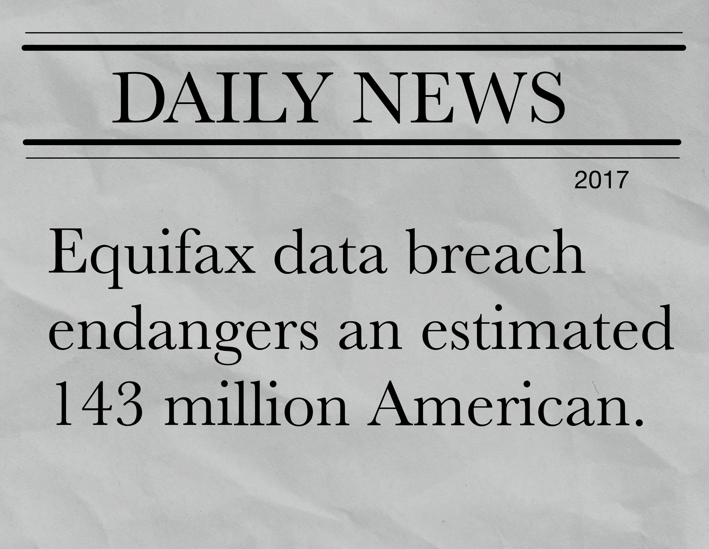

slidenumbers: false
autoscale: true
build-lists: false

# OWASP Top 10: 2021 Edition

### _Matthew Sheehan_

---

## About OWASP Top 10

[.text: alignment(left), text-scale(1)]
[.build-lists: true]

- 1st release in 2003. **>** 7th release in 2021.
- Targeted at developers, architects, and security professionals.
- The ten most critical risks identified in web applications.
  - Risk = Likelihood x Impact
- Built as a data-driven **_awareness_** document, not as a standard.
- Was actually suppose to be OWASP Top 10: 2020. :smile:

^ AWS was launched in 2006, Azure in 2008. Chrome was released in 2008.

^ Why doesn't the top 10 update more often? It would be hard to adopt training for the top 10 if it was a constantly moving target. The cadence generally is every 3 years.

^ Not suppose to be a standard, but somehow also does act as a pseudo-standard.
  The top 10 is the bare minimum baseline, not all-encompassing. It could have just as easily been the top 11 or top 20, because there is still the 11th - nth risk.

^ The data is voluntarily collected by 13 companies/organizations.
  Greater than half-million applications worth of vulnerability data with more than 400 unique CWE's.
  Data points included year, cwe, what kind of test it was (human, automated), number of apps found with at least one incident of the CWE.
  The data points are aggregated to determine an incident rate per CWE.

---

## What are the OWASP Top 10: 2021

[.text: alignment(left), text-scale(1)]

[.column]
 _Broken Access Control_
 _Cryptographic Failures_
 _Injection_
 Insecure Design
 _Security Misconfiguration_
 _Vulnerable & Outdated Components_

[.column]
 _Identification & Authentication Failures_
 Software & Data Integrity Failures
 **_Security Logging & Monitoring Failures_**
 **Server-Side Request Forgery**

^ The two highlighted were added because of survey responses. Whether they are a bigger deal than the data shows and it's just difficult to test for is yet to be determined.

^ Data by nature is historical and not predictive of future trends, hence 8 of the top ten were data driven, 2 were chosen based off of a survey.

^ The survey answers the question, "What do you believe should be in the top 10 that is not likely to show up in the data?" (either because it's too new or just hard to test for).
  Survey is sent out to LinkedIn, Facebook, and Twitter.

^ Titles are meant to be root causes, not symptoms.

---

## A01: Broken Access Control

[.text: alignment(left), text-scale(1)]
[.footer: :arrow_up::arrow_up::arrow_up::arrow_up: **A05: Broken Access Control**]

- Unauthorized access to accounts
- Unauthorized elevation of privilege
- Unauthorized create/read/update/delete operations

^ Unlike the slang term, A1 does not mean good in this scope

^ Most of the largest breaches involve broken access control.
  One of the more difficult vulnerabilites to fix because there is not just one way to fix them.

^ Principle of Complete Mediation

---

## A02: Cryptographic Failures

[.text: alignment(left), text-scale(1)]
[.footer: :arrow_up: Previously known as **A03:2017 Sensitive Data Exposure**.]

[.column]
- Ineffective/missing data-at-rest encryption.
- Ineffective/missing TLS.
- Recommendations:
  - Static code analysis tools.
  - Application Level Encryption.
  - Defense-in-depth

[.column]

^ Encryption is a form of access control

^ Focus on cryptographic usage and implementation.
  Bad keys? Bad ciphers? Bad cryptographic functions? Base64 is not encryption.

^ Static code analysis tools (Ex. catch hard-coded passwords).
^ Code reviews
^ Application Level Encryption (ALE) moves the boundaries of encryption to within the application itself.

^ Data Security
  Identify sensitive data
  Identify risks to data
  Build trust models
  Prioritize threat vectors

^ The 2021 Top 10 tries to focus more on root causes and not symptoms.
  Cyptographic failure is often a root cause for the symptom Sensitive Data Exposure.

---

## A03:2021 Injection

[.text: alignment(left), text-scale(1), Ostrich Sans Italic]
[.text-emphasis: #FFFFFF, Ostrich Sans, text-scale(1)]
[.footer: :arrow_down::arrow_down: **A01:2017 Injection**, includes **A07:2017 Cross-Site Scripting**]
<!-- [.footer-style: #7193ff, text-scale(1)] -->

- First version since 2010 not A01.

^ Better frameworks has been the driving factor the decline.
^ Cross-site scripting is one of the easier vulnerabilities to fix because of the improvement in frameworks.
^ Validate, sanitize, escape any data that crosses trust boundaries.
^ WAFs have many rules for blocking and detecting injection.

---

## A04: Insecure Design

[.text: alignment(left), text-scale(1)]
[.footer: :eight_pointed_black_star:]

- Requires considering security before code is written :grimacing:

^ One of the new categories in 2021. Slightly controversial.
^ Costly to fix now, costlier to fix later. Shift left.
^ Unit test, integration test
^ Adopt better frameworks
^ Threat modeling, secure reference architectures

^ Requires a holistic systems approach versus a component analysis
  Requires a top-down decomposition from the business objectives.
  Requires good visualization, hard to secure what you don't understand.

^ There are more than 10 vulnerabilities, it's just the OWASP top 10.

^ Engage developers, fun and engaging training, build security champions.

^ Establish security guiding principles 
  Separation of privilege, least privilege, defense-in-depth, open design, human factored security, scalable security (embrace automation)

---

## A05: Security Misconfiguration

[.text: alignment(left), text-scale(1)]
[.footer: :arrow_up: **A06: Security Misconfiguration**]

- Infrastructure as Code has lead to an increase in **catching** security misconfigurations.
  - But that's good!
- Challenges:
  - Keeping up with the latest public cloud provider changes.
  - Security is an emergent property of systems. Requires a multi-disciplinary approach.

^ Before IaC there were still security misconfigurations, there just wasn't tooling that could statically or dynamically analyze the infrastructure. IaC has given us that capability.
^ Now we can check the code to make sure the value is set to "HTTPS" for example.

^ Create the "paved-roads" for development.

^ Check for apps running on non-standard ports that might not have security policies applied to them.
^ Check for apps running with verbose logging.

---

## A06: Vulnerable and Outdated Components

[.text: alignment(left), text-scale(1)]
[.footer: :arrow_up::arrow_up::arrow_up: Previously known as **A09:2017 Using Components with Known Vulnerabilities**]
[.footer-style: text-scale(1)]

[.column]
- Recommendations:
  - CI/CD tools to warn for outdated components.

[.column]

---

## A07: Identification and Authorization Failures

[.text: alignment(left), text-scale(1)]
[.footer: :arrow_down::arrow_down::arrow_down::arrow_down::arrow_down: Replaces **A02: Broken Authentication**]

- Recommendations:
  - Follow best practices for passwords and rate limiting logins
  - Add MFA

^ Validate authentication and authorization for every request that shouldn't be public.

---

## A08: Software and Data Integrity Failures

[.text: alignment(left), text-scale(1)]
[.footer: :eight_pointed_black_star: Includes **A08:2017 Insecure Deserialization**]

- SolarWinds hack in 2021
- CI/CD pipelines without commit or build checks.

---

## A09: Security Logging and Monitoring Failures

[.text: alignment(left), text-scale(1)]
[.footer: :arrow_up: Previously known as **A10:2017 Insufficient Logging and Monitoring**]

- Attackers rely on insufficient logging and monitoring to achieve their goals before detection.
- Average time to identify a breach is 280 days.
- 80% of breaches involve PII.
- Recommendations:
  - Centralized, append-only logging and monitoring store.
  - Automatic alerting of suspicious activity.
  - Audit trail for logins, access failures, and "high-value" transactions.
  - Data hygiene across sources.
  - Expire the data when not needed anymore.

^ Perimeter security is not sufficient. (Zero-Trust Architecture)
^ Simple idea, difficult to implement.
  Requires signficant commitment, complexity, cost, and operational support.
  Challenges include tools, culture, budget, and training
^ Critical if you intend to prosecute
^ Necessary for breach disclosure laws
^ Static-code analysis can't find the absence
^ Difficult to have a centralized monitoring store without taking a multi-disciplinary approach.
  It's hard to get developers to care about security if they exist in their bubble, and QA exists in it's bubble.
  Developers have a lot of other things they are trying to do, build new features, improve quality, increase performance, build to scale. How do you get developer attention when security is a constantly moving target is very nuanced.
^ Beware the "honeypot" database - putting all your information in one database and now that is the database everyone wants to get into.

---

## A10: Server-Side Request Forgery

[.text: alignment(left), text-scale(1)]
[.footer: :eight_pointed_black_star:]

- Capital One in 2019
- Gitlab in 2021
- It's just as important to do authentication & access control between the backend services.
- Avoid taking URLs as a parameter that the server acts on.
- Limit services with network controls.

^ Restrict outgoing access on web servers, restrict incoming access on internal servers.

---

[.text: alignment(left), text-scale(1)]

## What to do?

- Update frameworks and languages.
- Adopt a security mindset, shift(expand)-left.
- Security is a moving target.
- A lot of security exists outside of code.
- Security is a process not a product.

^ What kind of attacks, the sophistication of attacks is always evolving.

^ Developers can't be expected to remember every detail, languages and frameworks need updated so that writing secure code is the default.

^ There are not enough AppSec professionals, you have to empower and support your developers.

- Other projects:
  - OWASP ASVS
  - OWASP SAMM
  - OWASP Proactive Controls

---

## Links

- https://owasp.org/Top10/
- https://github.com/OWASP/Top10

