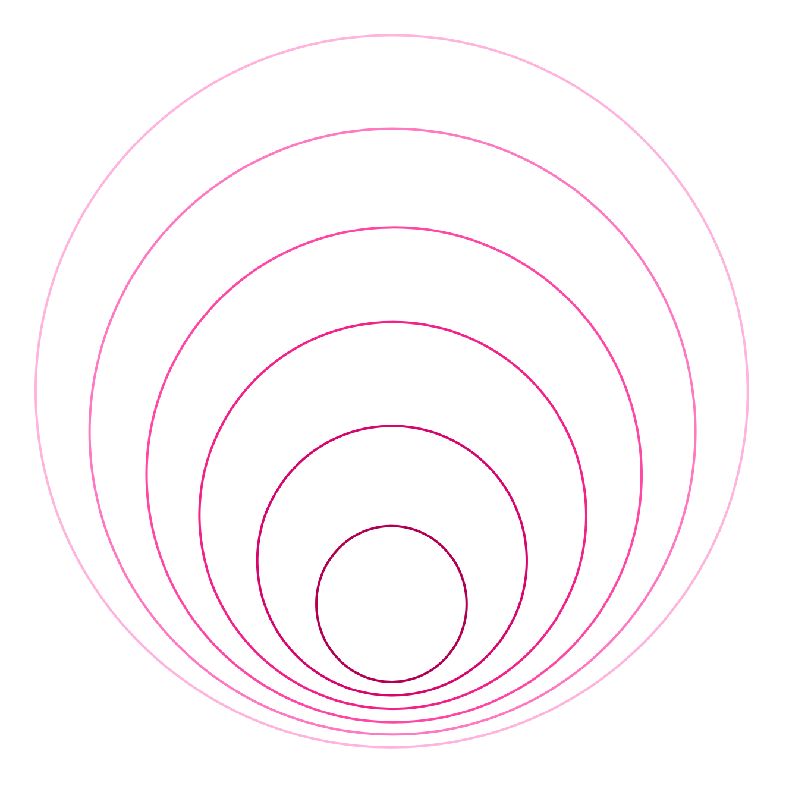
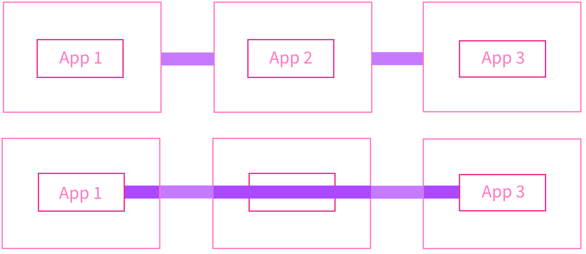
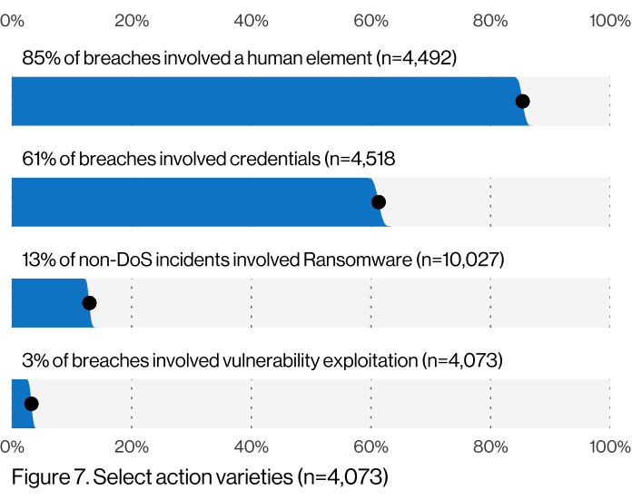
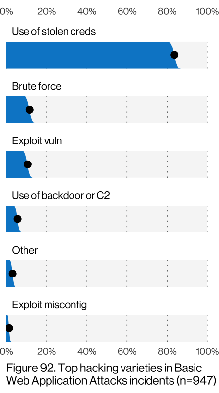
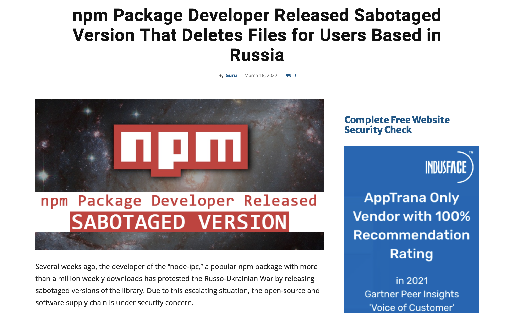
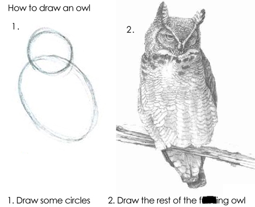

slidenumbers: false
autoscale: true
build-lists: false
list: bullet-character(∙)
text: alignment(left), text-scale(1.2), line-height(1)
theme: Titillium


# **OWASP Top 10:** 2021 Edition

### _Matthew Sheehan_

---

## About **OWASP Top 10**

1st release in 2003. **⁃** 7th release in 2021.

|  | Release |
| --- | --- |
| Chrome | 2008 |
| iPhone | 2007 |
| Azure | 2008 |
| AWS | 2006 |
| Git | 2005 |
| Facebook | 2004 |
| **OWASP Top 10** | **2003** |

^ Why doesn't the Top 10 update more often?
  - OWASP Top 10 has become a sort of defacto pseudo-standard, and companies do use it as a training resource.
  - So it would be hard to adopt training for the OWASP Top 10 if it was a constantly moving target.
  - The update cadence has generally been every 3 years.

---

## About **OWASP Top 10**

- Targeted at developers, architects, and security professionals.
- The ten most critical risks identified in web applications.
  - Risk = Likelihood x Impact
- Built as a data-driven **_awareness_** document, not as a standard.
- Was actually suppose to be OWASP Top 10: 2020. :sweat_smile:

^ Targeted at developers, architects, and security professionals.:
  - One of the biggest challenges to comprehensive security is figuring out how to engage multiple disciplines.
    - All the way through from designing the system, developing the system, and then system operation.

^ And you have to engage everyone.
  - There are just not enough AppSec professionals, you have to empower, support, and train everybody.
  - A lot of us are developers, there's a lot of stuff already that we are expected to know in detail, and security is probably not at the top of our minds.

^ The ten most critical risks identified in web applications.
  - Not solely indicative of the likelihood or the impact of the vulnerability, it's a combination of both the impact of the vulnerability and the likelihood of it.
  - And there should be an asterisk there that this is only the _Top 10_ not the only 10, it could have just as easily been the top 11 or top 20, because there are still many more risks.

^ Built as a data-driven **_awareness_** document, not as a standard
  - But the truth is is that it does also act as a pseudo-standard, and the people creating the list are aware of that.
  - The top 10 is the bare minimum baseline, not all-encompassing.
  - And keep in mind that this is the OWASP Top 10 and your organizations Top 10 might look a little different.


---

## What are the OWASP Top 10: 2021

[.text: line-height(1)]

[.column]
###  Broken Access Control
###  Cryptographic Failures
###  Injection
###  **Insecure Design**
###  Security Misconfiguration
###  Vulnerable & Outdated Components

[.column]
###  Identification & Authentication Failures
###  **Software & Data Integrity Failures**
###  _Security Logging & Monitoring Failures_
###  **_Server-Side Request Forgery_**


^ The Top 10 is determined by two parts.

^ The first 8 are determined by data collected and aggregated voluntarily by companies/organizations:
  - The data is voluntarily collected by 13 companies/organizations.
  - Greater than half-million applications worth of vulnerability data with more than 400 unique CWE's.
  - Compared to I think 30 CWE's in 2017 (CWE - Common Weakness Enumeration)
  - The data points are aggregated to determine an incident rate per CWE and then those are ordered.

^ The second part is the survey:
  - The survey answers the question, "What do you believe should be in the top 10 that is not likely to show up in the data?"
  - And the reason they include this is because there will always be some vulnerabilities that either because they too new or just hard to test for, makes them unlikely to show up in the data.
  - Data by nature is historical and not predictive of future trends, hence 8 of the top ten were data driven, 2 were chosen based off of a survey.
  - So whether they are a bigger deal than the data shows or they're just difficult to test for is yet to be determined.

^ They are then ordered from 1 to 10. Key:
  - Anything that is green is new for 2021.
  - Anything Bold was added in response to data collected.
  - Anything highlighted was added because of survey responses.

^ Although they are ordered from 1 to 10,
  - I would emphasize that the order of the list is not as important as being aware of them.
  - There are hundreds of vulnerabilities, so all of the 10 most common are going to be of equal importance if you zoom out a bit.
  - And so by nature of being a Top 10 list, it is an incomplete list. Since you could make a checklist with hundreds of items (kind of like the ASVS),

---

## A01: **Broken Access Control**

[.footer: :arrow_up::arrow_up::arrow_up::arrow_up: **A05: Broken Access Control**]

[.column]
- Unauthorized access to accounts
- Unauthorized elevation of privilege
- Unauthorized create/read/update/delete operations
- JWT tampering or Cookie manipulation
- CORS misconfigurations

[.column]
#### **_Recommendations_**
- Principle of Complete Mediation
- Principle of Least Privilege / Deny by default
- Minimize CORS usage


^ Unlike the slang term, A1 does not mean good in this scope

^ Most of the largest breaches involve broken access control.
  One of the more difficult vulnerabilites to fix because there is not just one way to fix them.

^ Unauthorized acccess to accounts
  - Bypassing access control checks or the access control checks do not exist.
  - Parameter tampering (modifying the url), modifying the internal application state.

^ Unauthorized elevation of privilege
  - Either acting as a user without being logged in as a user or acting as an admin while only being logged in as a user.
  - This can lead to **Unauthorized create/read/update/delete operations**

^ JWT or Cookie tampering
  - A lot of web APIs use JWTs and a lot of web sites use Cookies.
  - JWT are Base64 encoded strings - a header, a payload, and a signature
  - Storing JWTs in localStorage leaves you vulnerable to XSS attacks.
  - Cookies are sent with every request.
  - Cookies are vulnerable to CSRF attacks.

^ CORS misconfigurations
  - Allowing API access from unauthorized or untrusted sources.

^ Principle of Complete Mediation
  - Every request to access objects should be checked to ensure that they are allowed (mediated)
  - Not just the first check, and also not just external checks, but also internal requests between your services should be mediated.

^ Principle of Least Privilege
  - Applies not only to users of the application, but to the application itself,
    and what access they are given to databases, data, and other services.
    Ex. It's a rare case where the app needs a db user thats the db_owner, generally db_reader/db_writer are enough.

---

## A02: **Cryptographic Failures**

[.footer: :arrow_up: Previously known as **A03:2017 Sensitive Data Exposure**.]

[.column]
- Ineffective/missing data-at-rest encryption.
- Ineffective/missing TLS.
- Ineffective/missing password hashing.



[.column]
##### **_Recommendations_**
- Static code analysis tools
- HTTP Strict-Transport-Security Header (HSTS)
- Defense-in-depth
- Classify data processed
- Only store data you need
- Application Level Encryption


^ Footer
  - The 2021 Top 10 tries to focus more on root causes and not symptoms.
  - Cyptographic failure is often a root cause for the symptom Sensitive Data Exposure.

^ Ineffective/missing data-at-rest encryption
  - Bad keys? Bad ciphers? Bad cryptographic functions?
  - Base64 is not encryption.

^ Ineffective/missing TLS
  - Consider anything before TLS 1.2 deprecated, all SSL is deprecated.
  - When someone says SSL they are usually referring to TLS, its just the branding of SSL has stuck around.
  - Ensure that HTTPS directives are enabled so that the site is only reachable over TLS.

^ Ineffective/missing password hashing
  - Are you using non-cryptographic hash functions when cryptographic hash functions are needed?
  - There are certain hash algorithms known to be good password hash functions, and you should be using one of those.

^ Static code analysis tools
  - It's easy to catch if a password is hard-coded somewhere, a SAST tool can easily pick that up.

^ HTTP Strict-Transport-Security Header
  - Instructs the browser to only access the site by HTTPS
  - Keep in mind its only a browser instruction, other consumers of the API probably will not obey the instruction.
  - The only way to really enforce HTTPS is to configure applications to only listen and respond to HTTPS
  - But it's 2022 is there ever an exuse to use HTTP?

^ Defense-in-depth
  - Encryption is a form of access control if you think about it.
  - Only an authenticated identity should have the access permissions to decrypt data.
  - So even if your access control is broken, having the data encrypted provides that extra protection.
  - honeypots
    - lures for attackers, purposefully vulnerable to lure the attackers there to make it easier to detect them.
    - But then you have a lot of alerting and monitoring on that honeypot.
    - SIEM - Security information and event management.

^ Classify data processed
  - Identify which data is sensitive according to privacy laws and regulatory requirements.
  - Once you've identified sensitive data and the risks, you can build trust models, prioritize what the threats are.

---

## A02: **Cryptographic Failures**



```json
{
    "to": "App 1",
    "from": "App 2",
    "message": "encrypt(msg)"
}
```

^ Application Level Encryption (ALE)
  - Moves the boundaries of encryption to within the appliation itself.

---

## A03 **Injection**

[.text-emphasis: #FFFFFF, text-scale(1)]
[.footer: :arrow_down::arrow_down: **A01:2017 Injection**, includes **A07:2017 Cross-Site Scripting**]
<!-- [.footer-style: #7193ff, text-scale(1)] -->

- First version since 2010 not A01.
  - Improved frameworks attributed for the decline.
- LDAP injection, XSS, SQL

#### **_Recommendations_**
- Validate, sanitize, escape any data that crosses trust boundaries.
- Use frameworks that assemble HTML safely.
- WAFs have many rules for blocking and detecting injection.

^ LDAP injection, XSS, SQL
  - Probably as developers no one needs to worry about LDAP injection, maybe IT.
  - XSS, a type of injection where you inject code into a webpage (Note Footer).

^ Validate, sanitize, escape any data that crosses trust boundaries.
  - Any input you get from a client, input you receive from another API.

^ Use frameworks that assemble HTML safely
  - Better frameworks has been the driving factor the decline.
  - Cross-site scripting is one of the easier vulnerabilities to fix because of the improvement in frameworks.
    - One of the reasons it was combined into Injection.
    - Simple input-validation
      - validate file contents match their file extensions
      - validate the content-types (if you expect json, make sure it's json)

---

## A03 **Injection**

```
(?:[a-z0-9!#$%&'*+/=?^_`{|}~-]+(?:\.[a-z0-9!#$%&'*+/=?^_`{|}~-]+)*|"(?:[\x01-\x08\x0b\x0c\x0e-\x1f\x21\x23-\x5b\x5d-\x7f]|\\[\x01-\x09\x0b\x0c\x0e-\x7f])*")
 @(?:(?:[a-z0-9](?:[a-z0-9-]*[a-z0-9])?\.)+[a-z0-9](?:[a-z0-9-]*[a-z0-9])?|\[(?:(?:(2(5[0-5]|[0-4][0-9])|1[0-9][0-9]|[1-9]?[0-9]))\.){3}
 (?:(2(5[0-5]|[0-4][0-9])|1[0-9][0-9]|[1-9]?[0-9])|[a-z0-9-]*[a-z0-9]:(?:[\x01-\x08\x0b\x0c\x0e-\x1f\x21-\x5a\x53-\x7f]|\\[\x01-\x09\x0b\x0c\x0e-\x7f])+)\])
```

<br/>

> matt'or'1'!='@sheehan.codes

^ matt'or'@sheehan.codes'='@sheehan.codes
^ "'OR 1=1 --"
^ 'or%201=1--@sheehan.codes
^ "<script>alert(1)</script>"@sheehan.codes

<br/>

```sql
"SELECT * FROM [table] WHERE [email] = '" + email + "'"
```

^ Regex
  - RFC 5322 compliant email regex, email standard that describes the basic format for an email message
  - HTML5 weird email validation

^ Email injection
  - email me and I will respond! matt'or'1'!='@mattsheehan.dev
    - stolen from jim manicode, one of the core maintainers of the top 10

^ Prevention
  - Always parameterize queries
  - Even valid input can be dangerize

---

## A04: **Insecure Design**

[.footer: ✪]

[.column]
- The difference between an insecure design and an insecure implementation.
- Requires considering security before code is written. :grimacing:
- Secure design cannot be bolted on later.

[.column]
#### **_Recommendations_**
- Threat modeling, secure reference architectures
- Establish a Secure Development Lifecycle
- Establish security guiding principles 
- Unit test, integration test
- Adopt better frameworks


^ Insecure Design
  - One of the new categories in 2021. Slightly controversial.
  - If you want to build the house of your dreams what do you do first?
  - You don't immediately start laying the bricks before collecting the requirements your dream home would need.
  - And once you have your requirements, you go talk to an Architect.

^ The difference between an insecure design and an insecure implementation.
  - One is a design flaw, the other is a security bug.
  - A secure design can stil have implementation defects.
  - But an insecure design cannot be fixed even with a perfect implementation, by definition.
  - It's the difference between a design flaw and a security bug
  - An insecure design is costly to fix now, costlier to fix later

<!-- ^ Design flaws vs. Security Bugs
  - A design flaw is an issue when designing the software
    - reference architectures, gathering security requirements (nonfunctional requirements), and threat modeling help mitigate design flaws.
  - A security bug is an implementation issue
    - code reviews, security testing, secure coding training help mitigate security bugs. -->

^ Requires considering security before code is written
  - Security is often overlooked as its considered a non-functional requirement
    - Functional requirements are usually things like the features of a system
    - Non-functional requirements are things like properties of a system (availibility, scalability, reliability, testability, deployability, security) (the "ilities")

^ Secure design cannot be bolted on later.
  - Secure-by-design means software that has been designed from the ground up to be secure.
  - Requires a holistic systems approach versus a component analysis
  - Requires a top-down decomposition from the business objectives.
  - Requires good visualization, hard to secure what you don't understand.

^ Threat modeling, secure reference architectures
  - Every time you design a system you cannot start from a clean slate, there have to be some basic immutable principles, which is where reference architectures are needed.
  - You should know what your threas are for all the key flows: your authentication, access control, business logic

^ Establish a Secure Development Lifecycle
  - Goes beyond just Shift-Left.
  - Includes paved-road libraries, secured component libraries.

^ Establish security guiding principles 
  - Separation of privilege, least privilege, defense-in-depth, open design, human factored security, scalable security (embrace automation)

^ Unit test and integration tests
  - Validate that all critical paths are resistant to your threat models.

---

## A05: **Security Misconfiguration**

[.footer: :arrow_up: **A06: Security Misconfiguration**, includes **A04:2017 XML External Entities**]

[.column]
- Infrastructure as Code has lead to an increase in **catching** security misconfigurations.
- Improper configurations on cloud services, missing security hardening.
- Unnecessary features enabled/installed.

- Challenges:
  - Keeping up with the latest public cloud provider changes.
  - Security is an emergent property of systems. Requires a multi-disciplinary approach.

[.column]
#### **_Recommendations_**
- Static code analysis tools
- Create "paved-roads" for development
- Code reviews
- Read the docs


^ The rise in IaC can be attributed to the increase in security misconfigurations.
  - But that's a good thing!
  - Before IaC there were still security misconfigurations
  - There just wasn't tooling that could statically or dynamically analyze the infrastructure. IaC has given us that capability.

^ Improper configurations on cloud services
  - Security settings in the application are misconfigured.
  - Default accounts/passwords are enabled/unchanged.
  - Check for apps running on non-standard ports that might not have security policies applied to them.
  - Check for apps running with verbose (trace/debug) logging.

^ Challenges:
  - Keeping up with the latest public cloud provider changes.
    - Every week there is something new.
    - Not just every week but every day, there is something new in preview or something coming out of preview.
    - https://azure.microsoft.com/en-us/updates/
  - Security is an emergent property
    - There isn't one thing that makes you secure.
    - Requires a multi-disciplinary approach which attributes to the rise of DevOps.
      - It's not longer Developers writing code, Operations keeping it stable, and IT responsible for making it secure.

^ Code reviews
  - IaC brings the development best practices to IT and Operations.

^ Read the docs
  - If you want to learn the proper settings to configure something you have to read the manual.
  - There is a lot of documentation about how to harden your applications.

---

## A06: **Vulnerable and Outdated Components**

[.footer: :arrow_up::arrow_up::arrow_up: Previously known as **A09:2017 Using Components with Known Vulnerabilities**]

[.column]
- Would probably be A01 if re-evaluated after Log4Shell
- Modern software includes a lot of external code.
- Includes OS, runtimes, and libraries.
- Not upgrading dependencies in a risk-based, timely fashion.


[.column]
#### **_Recommendations_**
- Know the versions of all the components you use and indirectly use.
- Minimize the attack surface - remove unused dependencies.
- Obtain packages from official sources, ensure signed (A08:2021-Software and Data Integrity Failures)
- CI/CD tools to warn for outdated components.
- Continuously monitor for vulnerabilities.

^ Would probably be A01 if re-evaluated after Log4Shell
  - Log4Shell is the Log4j vulnerability that allowed for arbitrary code execution.

^ Modern software includes a lot of external code.
^ And that Includes the OS, runtimes, and libraries
  - We live in a time where OS patches should be happening regularly, not just monthly or quarterly schedule when IT can get around to it.

^ Not upgrading dependencies in a risk-based, timely fashion.
  - Continuously monitor for outdated components (Github Dependabot)
  - Continuously monitor for vulnerabilities (OWASP Dependency Check - software supply chain security tool)

^ Equifax
  - There was a third party software exploit (for Apache Struts), that had already of had been patched,
  - But Equifax failed to update their servers with the newer version.
  - I think the total number was actually higher than the 143 million listed there,
    - I think the total number of American with information stolen was closer to 147 million.
    - But once you get to those kind of stratospheric numbers, whats a few extra million.

---

## A07: **Identification and Authorization Failures**

[.footer: Verizon 2021 Data Breach Investigations Report]




^ 61% of breaches involve credentials

^ 80% of hacking attempts involve credentials

^ The way the Verizon report determines between an breach and an incident
  - A breach is the confirmed disclosure of data to an unauthorized party.
  - An incident is a security event that compromises the integrity of system, but doesn't result in compromised data.

^ https://haveibeenpwned.com
^ https://youtu.be/opRMrEfAIiI

---

## A07: **Identification and Authorization Failures**

[.footer: :arrow_down::arrow_down::arrow_down::arrow_down::arrow_down: Replaces **A02: Broken Authentication**]

[.column]
- Permitting weak or well known passwords.
- Permitting automated brute force / credential stuffing attacks.
- Permitting weakly hashed passwords (A02: Cryptographic Failures).
- Insecure password recovery.
- Sessions that never expire.
- Enumeration attacks.

[.column]
#### **_Recommendations_**
- Follow best practices for passwords and rate limiting logins.
- Validate authentication and authorization for every request that shouldn't be public.
- Countermeasure CSRF / XSS attacks > require re-authentication for sensitive features.
- Add Multi-factor Authentication where possible


^ Permitting weak or well known passwords
  - Passwords should be salted and hashed (one-way)

^ Permitting brute force / credential stuffing
  - Credential stuffing is using existing username and password combinations used in credential dumps. These lists of leaked credentials are easily acquired.
  - They are effective because users often reuse their username and passwords.
  - So it's not a total guessing game.

^ Insecure password recovery
  - What street did you grow up on?
  - What was your pets name?

^ Enumeration attacks
  - Ensure registration, credential recovery, and API pathways are hardened, use the same messages for all outcomes.

^ Follow best practices for passwords and rate limiting logins.
  - 10 failed login attempts in under a minute / 100 failed login attempts in 24 hours

^ Add Multi-factor Authentication where possible
  - MFA is a good prevention for credential stuffing, brute force attacks.
  - Preferably using an authenticator app as a two-step authentication. SMS is susceptible to SMS spoofing.
  - MFA is an effective strategy of preventing brute force type attacks.(99.9% according to Microsoft)

^ Why is access control number 1 but authorization number 7?
  - Because frameworks that handle authorization have improved over the years but
  - it's not possible for those frameworks to understand your Access Control policies.
  - Access Control policies are usually customized, involve the business layer, much more manual and much harder to standardize.

---

## A08: **Software and Data Integrity Failures**



^ I think this slide was suppose to come after the next one.
  Oh well, by the time I got to number 8 I was already a few beers in.

^ This is an article that came across my feed the other day, and this affects users in Russia
  - But how easy would it be for this to happen to any package?
  - It's sort of crazy that we've built an entire software supply chain on the promise that nothing malicious will get uploaded.

---

## A08: **Software and Data Integrity Failures**

[.footer: :eight_pointed_black_star: Includes **A08:2017 Insecure Deserialization**]

[.column]
- Plugins or libraries from untrusted sources.
- CI/CD pipelines without commit or build checks.

#### **_Recommendations_**
- Verify software and data is from trusted sources.
- Verify components do not contain known vulnerable dependencies.
- CI/CD has proper configuration and access control.

[.column]


^ Plugins or libraries from untrusted sources
  - I'm looking at you javascript developers.
  - Downloading libraries from untrusted sources is like the whole security model of NPM.
  - Maybe a system composed of layers and layers of constantly updating code by whoever is not the most ideal system.

^ Verify software and data is from trusted sources
  - Verify digital signatures

^ Verify components do not contain known vulnerable dependencies
  - Once again OWASP Dependency Check
  - OWASP CycloneDX operates as a bill-of-materials to capture your inventory of libraries and frameworks

^ CI/CD has proper configuration and access control
  - What happened with SolarWinds is essentially their build system was compromised
  - and hackers were able to inject unverified code.

^ Footer: Insecure deserialization
  - You probably know this, but programming languages allow you to turn a tree of objects into a string and send that to and from the browser.
  - If you receive and deserialize that string from an untrusted source it may allow objects or code to be executed.

^ SolarWinds hack
  - Hackers broke into the SolarWinds injected malicious code as part of the build process for their IT software that was distributed to customers as part of an automatic update.
  - This was a particularly big deal because the US government used that software and it ultimately ended with sanctions on Russia.
  - Not just a failure of software integrity, but also a failure of logging and monitoring.
  - Russian hackers were in the system for more than a year before it was noticed.
  - Test injection "trial" was ran a year before.
  - Was a major national security issue.

---

## A09: **Security Logging and Monitoring Failures**

[.footer: :arrow_up: Previously known as **A10:2017 Insufficient Logging and Monitoring**]

[.column]
- Attackers rely on insufficient logging and monitoring to achieve their goals before detection.
- Average time to identify a breach is 280 days.
- 80% of breaches involve PII.

[.column]
#### **_Recommendations_**
- Centralized, append-only logging and monitoring store.
- Automatic alerting of suspicious activity.
- Audit trail for logins, access failures, and "high-value" transactions.
- Data hygiene across sources.
- Expire the data when not needed anymore.


^ Attackers rely on insufficient logging and monitoring to achieve their goals before detection.
^ Simple idea, difficult to implement.
  - Requires signficant commitment, complexity, cost, and operational support.
  - Challenges include tools, culture, budget, and training
  - Ex. Static-code analysis can't find the absence of logging.
^ Necessary for breach disclosure laws
^ Critical if you intend to prosecute

^ Average time to identify a breach is 280 days.
  - Usually security vulnerabilities are found from outside the company.
  - ex. someone reports a fraudulent transcation.

^ Centralized, append-only logging and monitoring store.
^ Difficult to have a centralized monitoring store without taking a multi-disciplinary approach.
  It's hard to get developers to care about security if they exist in their bubble, and QA exists in it's bubble.
  Developers have a lot of other things they are trying to do, build new features, improve quality, increase performance, build to scale. How do you get developer attention when security is a constantly moving target is very nuanced.

^ Beware the "honeypot" database - putting all your information in one database and now that is the database everyone wants to get into.

---

## A09: **Security Logging and Monitoring Failures**

[.footer: https://cheatsheetseries.owasp.org/cheatsheets/Logging_Vocabulary_Cheat_Sheet.html]

[.column]
#### What to log
- Input validation failures (invalid parameter names, invalid protocol)
- Output validation failures (database record mismatch)
- Authentication failures and successes
- Application errors
- Application startup, shutdown, configuration changes
- High-risk functions (All access control events, deleting users, assigning privileges, all actions by administrative users, data imports and exports)

^ Input validation failures
  - invalid parameter names, invalid protocol

^ Output validation failures
  - database record mismatch

^ Authentication failures and successes
^ Application errors
^ Application startup, shutdown, configuration changes
^ High-risk functions
  - All access control events, deleting users, assigning privileges, all actions by administrative users, data imports and exports

^ Footer
  - I do want to bring attention to the footer and the cheatsheet for logging
  - It's particularly good in the way to lays out an logging message standard that can actually be implemented.

[.column]
#### What not to log
- PII and PHI
- Access tokens and Session IDs
- Connection strings
- Encryption keys and secrets

^ PII and PHI
^ Access tokens and Session IDs
  - These are your JWT tokens
  - Could use a hashed value of the user session id to track session events
^ Connection strings
^ Encryption keys and secrets

---

## A10: **Server-Side Request Forgery**

[.footer: ✪]

[.column]
- It's just as important to do authentication & access control between the backend services.
- Avoid taking URLs as a parameter that the server acts on.
- Limit services with network controls.
- Gitlab in 2021

#### **_Recommendations_**
- Restrict outgoing access on web servers, restrict incoming access on internal servers.
- Zero-Trust Architecture, perimeter security is not sufficient.
- Avoid taking URLs as a full parameter that the server acts upon.
- Build safe URLs with URL encoding of parameters.

[.column]


^ SSRF is the backend version of CSRF (Cross-Site Request Forgery)
  - Instead of the browser performing some unwanted request in an authenticated state, it's using the servers permissions.

^ Capital One breach
  - Part of the reason I think SSRF made the top 10 list is that there have been a few high profile breaches because of it.
  - Details of the breach
    - Capital One had a server hosted in AWS
    - Now in AWS is an endpoint that is private to AWS but is accessible to every service AWS and only AWS (That's important for later)
      - And that AWS endpoint is the metadata URL that returns the metadata of the resources
    - The VM accepted a URL as a parameter and then it used that URL to redirect traffic to other services.
    - The attackers knew that the VM was hosted in AWS, so that replaced the URL parameter with http://169.254.169.254/
    - They VM directed the request to the metadata endpoint and returned metadata about itself, including it's permissions.
    - The attackers noticed that the VM was allocated with excessive permissions to S3 storage buckets
    - And then they used those permissions of the VM + metadata endpoint to list the S3 buckets and download them.

---

## Next Steps



- Security is a process not a product.
- Security is always a moving target.
- A lot of security exists outside of code.
- Adopt a security mindset, shift(expand)-left.

^ Security is a process not a product.
  - The kind like the owl, there are a lot of steps that are not listed anywhere here.
  - There's not really anything you can do in security that will make the business money.
  - The best case scenario is it potentially loses them less money down the road.

^ Security is always a moving target.
  - What kind of attacks, the sophistication of attacks is always evolving.

^ Engage developers, fun and engaging training, build security champions.
  - Forcing security on developers doesn't work, you cannot dictate security.
  - Developers have to take ownership of security themselves, sometimes that requires a little give and take.

^ Secure coding
  - Sometimes called defensive coding.
  - Assumes that users are going to use the application in ways not intended.

---

## Other projects
- OWASP ASVS
- OWASP SAMM
- OWASP Proactive Controls

^ Owasp SAMM
  - Sofware assurance maturity model
  - A method to analyze your security posture

^ Owasp proactive controls
  - A list of controls and techniques that should be included in every project

## Links

- https://owasp.org/Top10/
- https://github.com/OWASP/Top10
- https://www.verizon.com/business/resources/reports/dbir/2021/masters-guide/
- https://youtu.be/opRMrEfAIiI

^ Funny video from 2015 on jimmy kimmel, probably the only funny thing he's ever done.